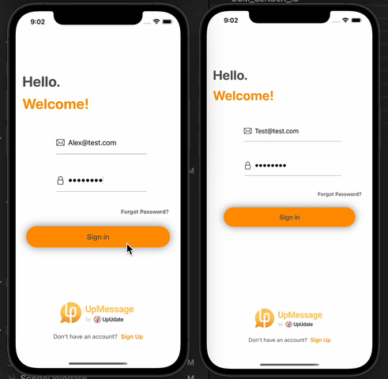

# SwiftUIChatApp

## Description 
This is a fully functional IOS messaging app written in SwiftUI. The backend is connected to Firebase. The app is downloadable after you clone the app and run it in your terminal using git clone.

## Gif of App

